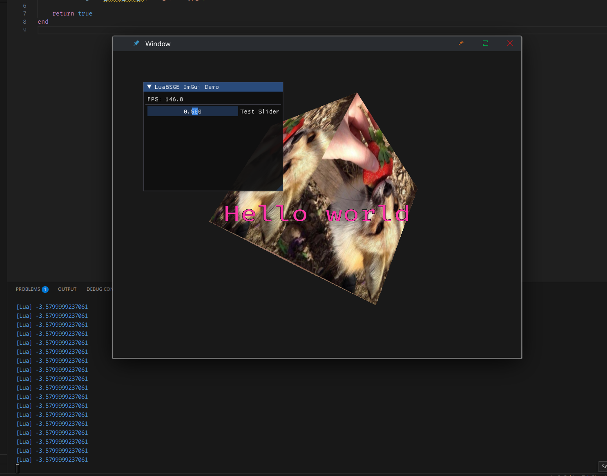
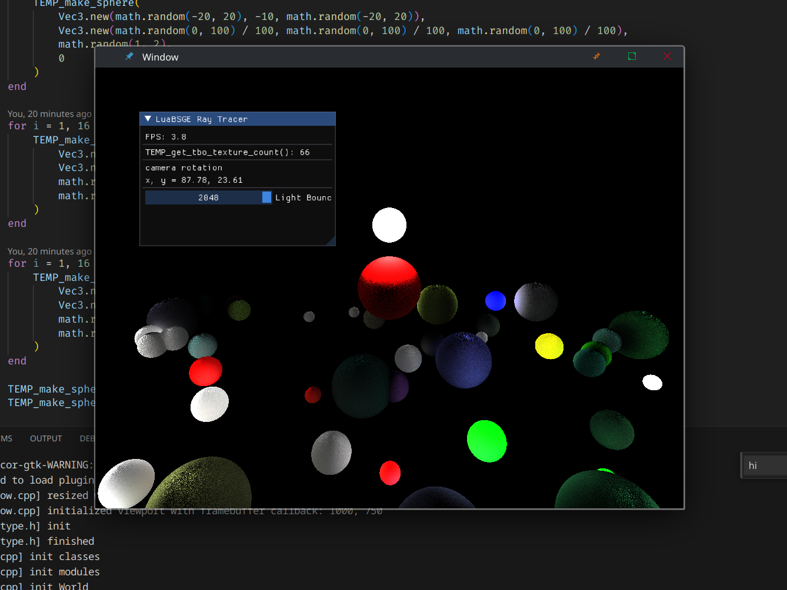
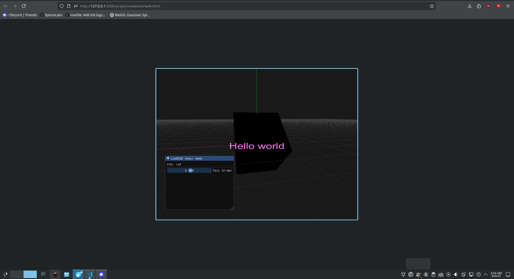

# Luabsge

Small rendering engine that integrates Lua with OpenGL. 

| test                                                  | raytracer                                                |  webtest                                                  |
| ----------------------------------------------------- | -------------------------------------------------------- |  ----------------------------------------------------- | 
|                           |                    |                       |

## dependencies

-   glm
-   glfw
-   freetype2
-   imgui
-   assimp
-   sol2

## compilation

run `./run.sh test` to run the test project

note: LuaBSGE is only tested on Linux right now

## features

-   OpenGL window drawing
-   GLM bindings
-   Mesh and texture loading
-   ASCII Font rendering
-   Post process shader effects
-   Ray tracing TBO support
-   ImGUI support

## todo

-   Import physics engine, export map to a test project, bvh for raytracer

-   Showstoppers
    -   Abstracting objects properly
        -   Design a better abstraction layer
    -   Web build support
        -   Texture loading
    -   Physics
        -   Self explanatory
    -   Editor (Needs physics for raytests)
        -   Scene creation format for a datamodel
    -   Audio
-   Other
    -   RT Test improvements
    -   UTF-8 Rendering
    -   Text rendering has really weird positioning
    -   Text rendering cuts off with high scale (you need to resize the window once to fix it)
    -   Cross-platform support

## goals

-   To have fun
