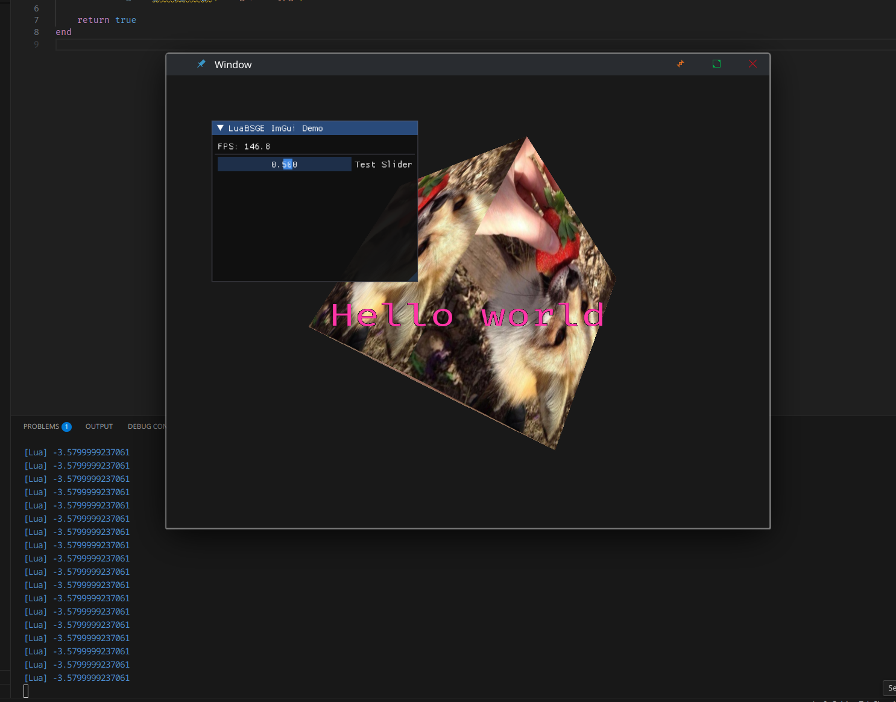

# Luabsge

Small "game engine" that integrates Lua with OpenGL. 

## dependencies

-   glm
-   glfw
-   freetype2
-   imgui
-   assimp
-   sol2

## compilation

run `./run.sh test` to run the test project

note: LuaBSGE is only tested on Linux right now

## todo

-   Create a universal class constructor
-   Make creating new classes easier
