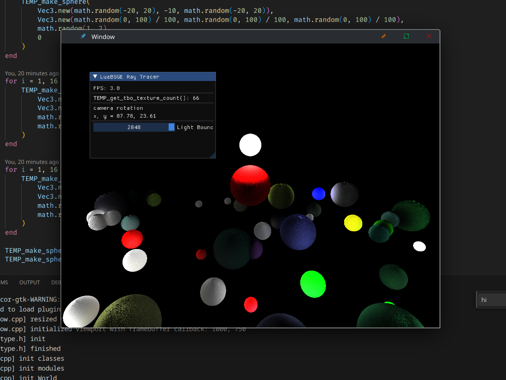

# Luabsge

Small rendering engine that integrates Lua with OpenGL. 

| test                                                  | raytracer                                                |
| ----------------------------------------------------- | -------------------------------------------------------- |
|                           |                              |

## dependencies (archlinux)

-   glm
-   glfw
-   freetype2
-   imgui
-   assimp
-   sol2

## compilation

run `./run.sh test` to run the test project

note: LuaBSGE is only tested on Linux right now

## todo

-   Showstoppers
    -   Physics
        -   Self explanatory
    -   Editor
        -   Scene creation format for a datamodel
    -   Audio
-   Other
    -   RT Test improvements
    -   UTF-8 Rendering
    -   Text rendering has really weird positioning
    -   Text rendering cuts off with high scale (you need to resize the window once to fix it)
    -   Cross-platform support